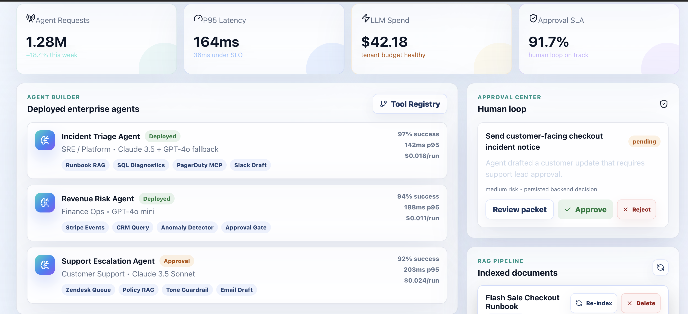
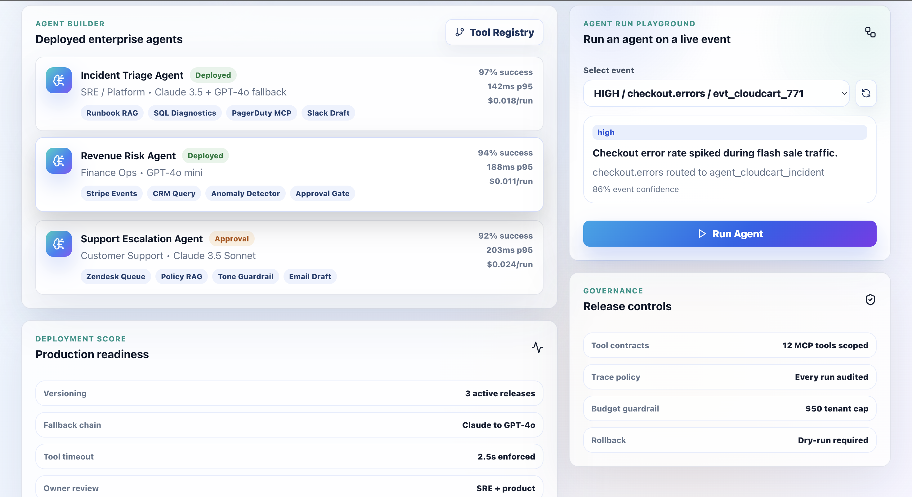
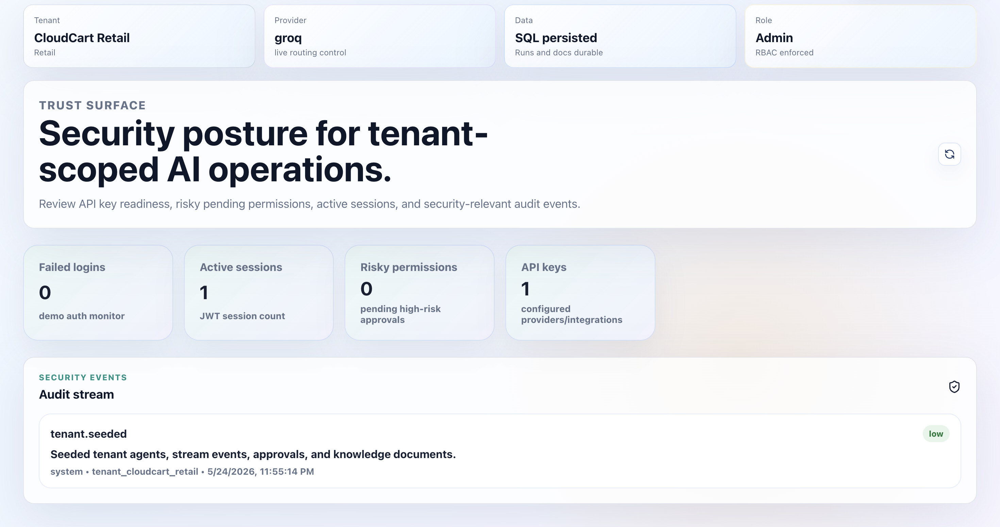
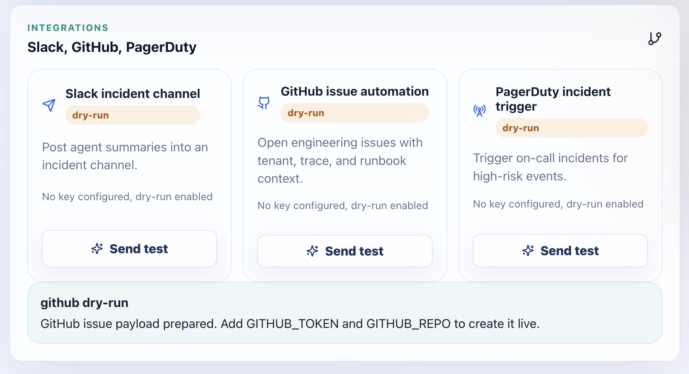

# Enterprise AI Ops Hub

An interview-grade enterprise SaaS project that combines full-stack engineering, GenAI, agent orchestration, RAG, streaming systems, cloud-native deployment, observability, and human-in-the-loop governance.

## What It Does

Enterprise AI Ops Hub lets teams configure autonomous AI agents that monitor real-time operational events, search internal knowledge, explain incidents, recommend actions, and request human approval before executing risky workflows.

## Product Screenshots

### Command center: agents, approvals, metrics, and RAG in one workspace



### Agent builder: run governed AI agents on live operational events



### Security center: tenant-scoped access, sessions, API keys, and audit stream



### Integrations: Slack, GitHub, and PagerDuty automation hooks



## Architecture

- **Frontend:** React, TypeScript, Vite, Tailwind-style CSS system, dashboard-first UX
- **Backend:** FastAPI, SQLAlchemy repositories, tenant-aware service layer
- **Agents:** LangGraph-ready orchestration boundary with tool contracts and approval gates
- **RAG:** document upload, chunking, local embeddings, retrieval, source attribution
- **LLM Providers:** local fallback plus OpenAI and Anthropic adapter boundaries
- **Streaming:** Kafka consumer boundary, event ingestion API, WebSocket live updates
- **Data:** SQLite locally, PostgreSQL/pgvector-ready data model
- **Infra:** Docker Compose, Kubernetes manifests, Terraform AWS skeleton
- **Testing:** Pytest backend tests, TypeScript build, Playwright E2E tests

## Main Product Areas

1. Agent Builder: create enterprise agents with tools, models, budgets, permissions, and guardrails.
2. Live Operations: stream business and infrastructure events into the platform.
3. RAG Knowledge Base: upload internal docs, chunk/embed them, retrieve with source citations.
4. Observability: track latency, cost, token use, model quality, hallucination risk, and success rate.
5. Approval Center: require human review before agents run high-impact actions.
6. Admin Console: switch tenants, test integrations, review audit logs, and export CSV evidence.
7. Agent Marketplace: deploy governed templates for incident, support, revenue, security, and compliance workflows.
8. Executive ROI: show incidents avoided, hours saved, cost controls, and monthly value estimates.
9. Security Center: inspect API key posture, risky permissions, active sessions, and security-relevant audit events.

## Demo Login Accounts

The app now uses backend-issued JWT sessions and tenant memberships.

| Role | Email | Password |
| --- | --- | --- |
| Admin | `admin@aiopshub.local` | `admin123` |
| SRE | `sre@aiopshub.local` | `sre123` |
| Support Lead | `support@aiopshub.local` | `support123` |
| Viewer | `viewer@aiopshub.local` | `viewer123` |

## Run Locally

```bash
cd enterprise-ai-ops-hub
npm install
npm run dev:all
```

That starts both the FastAPI backend on `http://127.0.0.1:8000` and the Vite frontend on `http://127.0.0.1:5173`.

If you prefer separate terminals:

```bash
python3 -m venv .venv
source .venv/bin/activate
pip install -r backend/requirements.txt
npm run api
```

Then start the frontend:

```bash
npm run dev
```

Run verification:

```bash
npm --prefix frontend run build
.venv/bin/python -m pytest backend/tests
npm --prefix frontend run e2e
```

Database migrations:

```bash
alembic upgrade head
alembic revision --autogenerate -m "describe change"
```

Production readiness:

```bash
curl http://127.0.0.1:8000/ready
```

See [docs/PRODUCTION_READINESS.md](docs/PRODUCTION_READINESS.md) for the hardening checklist and buyer-facing positioning.

Production-style Docker smoke path:

```bash
JWT_SECRET="change-this-to-a-long-random-value" docker compose -f docker-compose.prod.yml up --build
```

Then open `http://127.0.0.1:8080` and check API readiness at `http://127.0.0.1:8000/ready`.

## New Production-Grade Capabilities

- Persistent agents, stream events, approvals, documents, document chunks, and agent runs.
- Text document upload with chunking and deterministic local embeddings.
- RAG query endpoint with source citations and confidence scoring.
- LLM router with local fallback, OpenAI adapter, and Anthropic adapter.
- Kafka consumer scaffold for real topic ingestion.
- Agent marketplace with deployable enterprise templates.
- First-run onboarding wizard that records buyer-ready setup plans.
- Security Center and Executive ROI dashboard for sales-ready demos.
- Alembic migration scaffolding for managed database evolution.
- Playwright E2E coverage for desktop and mobile core flows.

## Useful API Endpoints

- `GET /api/v1/agents`
- `GET /api/v1/events`
- `POST /api/v1/events`
- `POST /api/v1/events/{event_id}/run`
- `GET /api/v1/runs`
- `POST /api/v1/documents/upload`
- `GET /api/v1/rag/query?query=...`
- `POST /api/v1/llm/complete`
- `GET /api/v1/agent-templates`
- `POST /api/v1/agent-templates/{template_id}/deploy`
- `POST /api/v1/onboarding`
- `GET /api/v1/security/summary`
- `GET /api/v1/roi`
- `GET /ready`

## Why This Project Is Strong

This is not a chatbot demo. It models how serious companies actually deploy AI: multi-tenant permissions, event streams, retrieval, model abstraction, cost governance, audit trails, approval workflows, and cloud-native operations.
